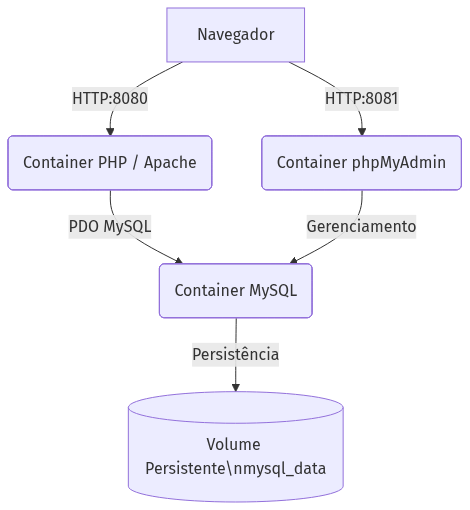

# Gerenciador de Tarefas Acadêmicas - Dockerizado

## Descrição do Projeto
Este projeto é um sistema de Gerenciamento de Tarefas Acadêmicas construído em PHP (padrão MVC) e MySQL. Como parte do Trabalho Prático da disciplina, a aplicação foi conteinerizada utilizando Docker e Docker Compose. Toda a infraestrutura sobe com um único comando, criando e populando automaticamente o banco de dados.

## Tecnologias Utilizadas
- **PHP 8.2** (com PDO MySQL e Apache)
- **MySQL 8.0**
- **Docker**
- **Docker Compose**
- **phpMyAdmin** (Desafio implementado)

## Estrutura do Projeto
```text
projeto/
├── app/                  # Contém os códigos fonte da aplicação PHP (MVC)
│   ├── index.php         # Ponto de entrada do sistema
│   ├── config/           # Conexão com o Banco de Dados (Database.php)
│   ├── controllers/      # Controladores da aplicação
│   ├── models/           # Classes de Modelo da aplicação
│   └── views/            # Telas da interface web
├── database/
│   └── init.sql          # Script de criação das tabelas e população inicial (Executado no Docker)
├── frontend/             # O projeto SPA em Next.js construído anteriormente
├── Dockerfile            # Configura a imagem do Apache com as extensões PHP (pdo_mysql)
├── docker-compose.yml    # Orquestra os serviços: app, db e phpmyadmin
├── .env                  # Variáveis de ambiente com as credenciais do banco
├── diagrama.png          # Diagrama visual de arquitetura
└── README.md             # Esta documentação
```

## Como Executar

Não é necessário configurar servidores web ou servidores de banco de dados na máquina host. Apenas tenha o Docker e o Git instalados.

1. **Clone o repositório:**
   ```bash
   git clone <url-do-repositorio>
   cd <pasta-do-projeto>
   ```

2. **Inicie os containers:**
   ```bash
   docker-compose up -d --build
   ```

3. **Acesse as aplicações:**
   - **Sistema Gerenciador:** [http://localhost:8080](http://localhost:8080)
   - **Gerenciador do Banco de Dados (phpMyAdmin):** [http://localhost:8081](http://localhost:8081)

## Credenciais do Sistema
Ao subir os containers, a inicialização do MySQL vai criar e popular o banco automaticamente (`database/init.sql`). Você pode fazer login no sistema com a seguinte conta de teste padrão:

- **E-mail:** `admin@admin.com`
- **Senha:** `admin123`

## Evidências
*(O professor/avaliador verá aqui as capturas de tela conforme solicitado na avaliação: inclua fotos dos containers em execução, a aplicação funcionando na porta 8080, e o banco populado visto através da porta 8081).*


