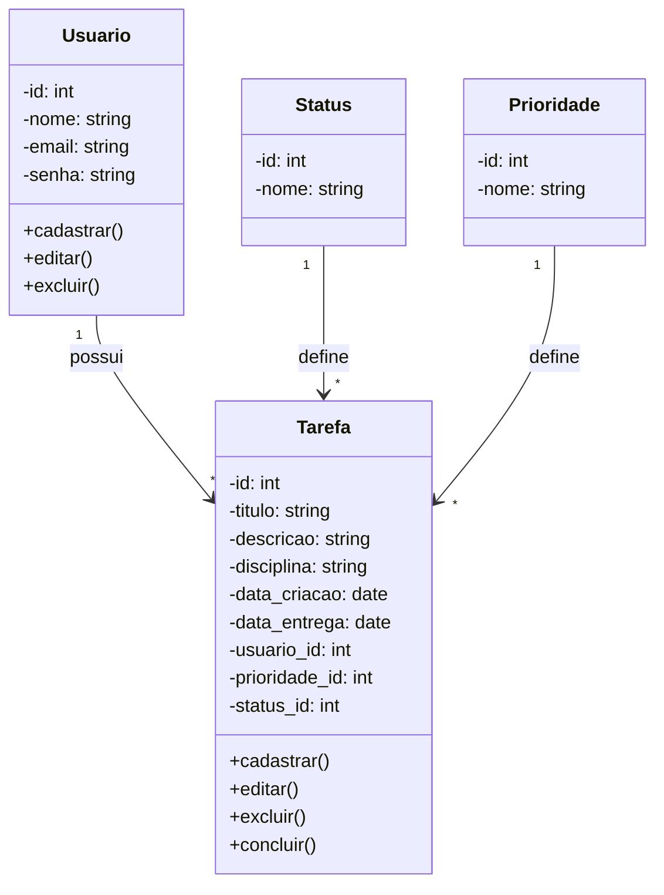

# Gerenciador de Tarefas para Alunos do Ensino Superior

## Contexto
Sistema de gerenciamento de tarefas voltado para alunos de cursos superiores,
permitindo organizar atividades acadêmicas por disciplina, prioridade e status.

## Tecnologias
- **Linguagem:** PHP
- **Banco de dados:** SQLite via PDO
- **Interface:** HTML + Tailwind CSS (via CDN)

## Design
- Utilizar **Tailwind CSS** via CDN no `<head>` de todas as páginas
- Layout responsivo que funcione bem em desktop e mobile
- Interface limpa, moderna e intuitiva
- Usar cards para exibir as tarefas
- Cores para diferenciar as prioridades:
  - Baixa → verde (`green`)
  - Média → amarelo (`yellow`)
  - Alta → laranja (`orange`)
  - Urgente → vermelho (`red`)
- Cores para diferenciar os status:
  - Pendente → cinza (`gray`)
  - Em andamento → azul (`blue`)
  - Concluída → verde (`green`)
- Feedback visual para ações (cadastro, edição, exclusão, conclusão)
- Botões com ícones e hover effects

## Diagrama de Classes


## Banco de Dados
O sistema deve utilizar **SQLite** como banco de dados, criado automaticamente
pelo PHP na primeira execução via PDO.

```sql
CREATE TABLE IF NOT EXISTS status (
    id INTEGER PRIMARY KEY AUTOINCREMENT,
    nome TEXT NOT NULL
);

CREATE TABLE IF NOT EXISTS prioridade (
    id INTEGER PRIMARY KEY AUTOINCREMENT,
    nome TEXT NOT NULL
);

CREATE TABLE IF NOT EXISTS usuario (
    id INTEGER PRIMARY KEY AUTOINCREMENT,
    nome TEXT NOT NULL,
    email TEXT NOT NULL UNIQUE,
    senha TEXT NOT NULL
);

CREATE TABLE IF NOT EXISTS tarefa (
    id INTEGER PRIMARY KEY AUTOINCREMENT,
    titulo TEXT NOT NULL,
    descricao TEXT,
    disciplina TEXT,
    data_criacao TEXT NOT NULL DEFAULT (DATE('now')),
    data_entrega TEXT,
    usuario_id INTEGER NOT NULL,
    prioridade_id INTEGER NOT NULL,
    status_id INTEGER NOT NULL,
    FOREIGN KEY (usuario_id) REFERENCES usuario(id) ON DELETE CASCADE,
    FOREIGN KEY (prioridade_id) REFERENCES prioridade(id),
    FOREIGN KEY (status_id) REFERENCES status(id)
);

INSERT INTO status (nome) VALUES
    ('Pendente'),
    ('Em andamento'),
    ('Concluída');

INSERT INTO prioridade (nome) VALUES
    ('Baixa'),
    ('Média'),
    ('Alta'),
    ('Urgente');
```

## Páginas do Sistema
- `index.php` — tela de login
- `cadastro.php` — tela de cadastro de usuário
- `dashboard.php` — listagem de tarefas do usuário logado
- `tarefa_form.php` — formulário de cadastro e edição de tarefa
- `tarefa_excluir.php` — exclusão de tarefa
- `logout.php` — encerramento de sessão
- `db.php` — conexão com o banco e criação das tabelas

## Funcionalidades Obrigatórias

### Usuário
- Cadastrar usuário com nome, email e senha
- Editar dados do usuário
- Excluir usuário (e suas tarefas em cascata)
- Login com email e senha
- Logout

### Tarefa
- Cadastrar tarefa com título, descrição, disciplina, data de entrega, prioridade e status
- Editar tarefa
- Excluir tarefa
- Marcar tarefa como concluída
- Listar tarefas do usuário logado
- Filtrar tarefas por status, prioridade e disciplina
- Ordenar tarefas por data de entrega e prioridade

## Regras de Negócio
- Um usuário pode ter muitas tarefas
- Cada tarefa pertence a apenas um usuário
- Cada tarefa possui obrigatoriamente um status e uma prioridade
- A disciplina é um campo de texto livre na tarefa
- Ao excluir um usuário, todas as suas tarefas são excluídas automaticamente
- A senha deve ser armazenada com `password_hash()` e validada com `password_verify()`
- A data é armazenada no formato `YYYY-MM-DD`
- O sistema deve usar sessões PHP (`$_SESSION`) para controle de login
- Todas as queries devem usar PDO com prepared statements para evitar SQL Injection
- Páginas protegidas devem redirecionar para `index.php` se o usuário não estiver logado

## Níveis de Prioridade
| id | nome    |
|----|---------|
| 1  | Baixa   |
| 2  | Média   |
| 3  | Alta    |
| 4  | Urgente |

## Status disponíveis
| id | nome          |
|----|---------------|
| 1  | Pendente      |
| 2  | Em andamento  |
| 3  | Concluída     |
